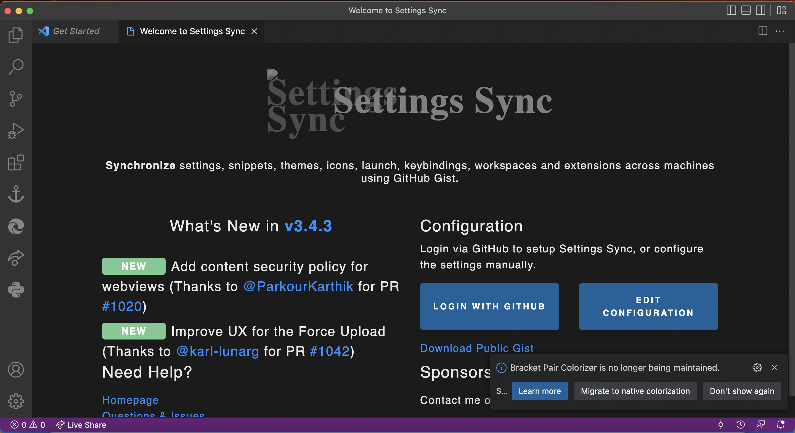
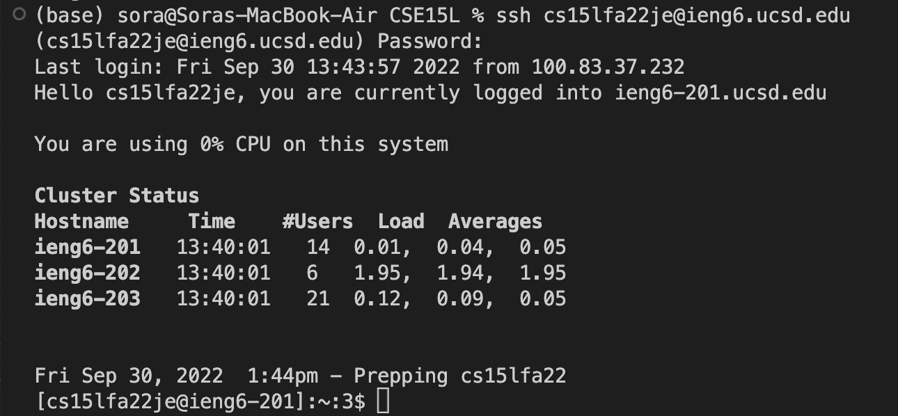
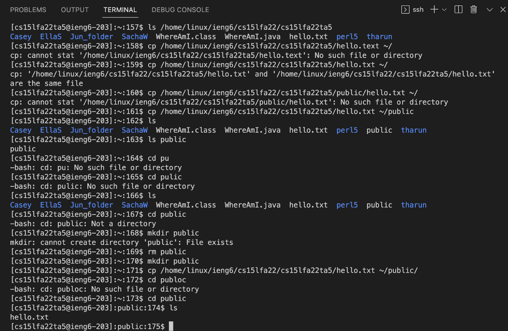
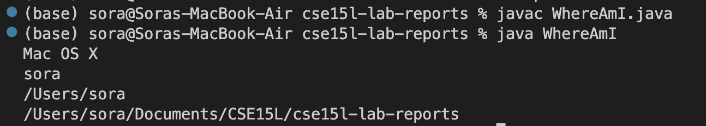
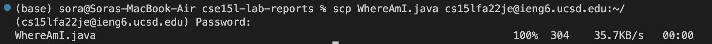
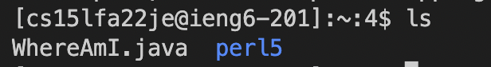
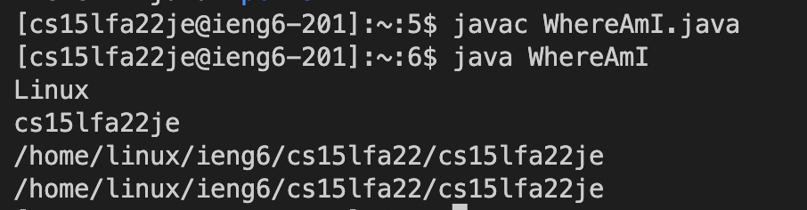
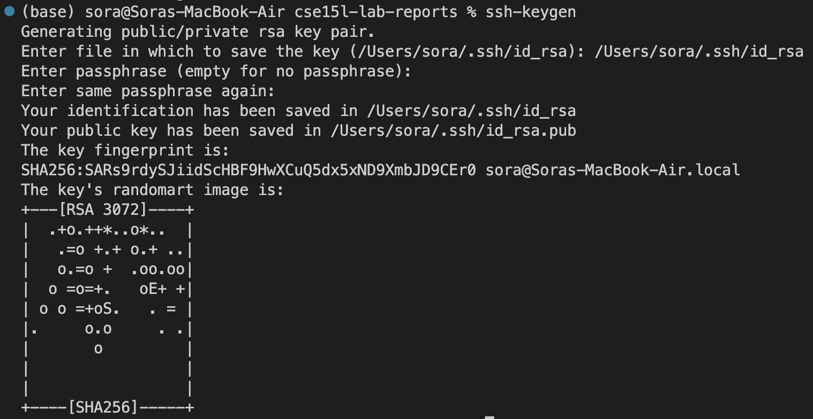
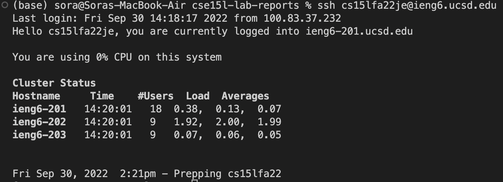
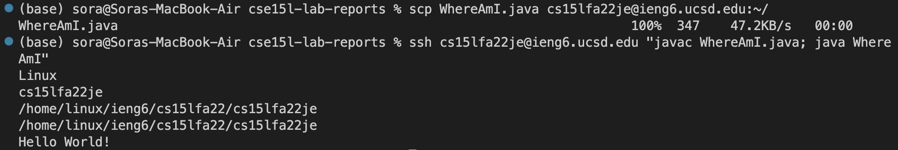

## Installing VScode

Go to the Visual Studio Cod website https://code.visualstudio.com/ and download VS Code according to your operating system.

After it is installed, you will open the Visual Studio Code app which will look like this.



## Remotely Connecting

Open the terminal in VS Code by pressing 'Ctrl+ \`', which will bring out the terminal. <br>
In the terminal, type in the command `ssh cs15lfa22je@ieng6.ucsd.edu`, and the system will prompt for password and you are going to type it in.
After you successfully log in, you will see something like this:


## Trying Some Commands

You can run some command in the remote server such as:
- `ls /home/linux/ieng6/cs15lfa22/cs15lfa22ta5` command prints out all the content in the folder from the path.
- `cp /home/linux/ieng6/cs15lfa22/cs15lfa22ta5/hello.txt ~/public` copy the hello.txt file in the folder to the public directory.
- `cd public` goes into the directory public.



## Moving Files with scp

First we want to go back and work on our local server, we can log out by using the command `exit`.
Create a java file called 'WhereAmI.java', and put these code in it:
```
class WhereAmI {
  public static void main(String[] args) {
    System.out.println(System.getProperty("os.name"));
    System.out.println(System.getProperty("user.name"));
    System.out.println(System.getProperty("user.home"));
    System.out.println(System.getProperty("user.dir"));
  }
}
```
After that, compile the file by typing the command `javac WhereAmI.java`, and then run `java WhereAmI`.



Next we can copy the file to our remote server by using the command `scp WhereAmI.java cs15lfa22je@ieng6.ucsd.edu:~/`



Then we can log in the remote server by using `ssh cs15lfa22je@ieng6.ucsd.edu` command, after that, use `ls` command we can see the `WhereAmI.java` file we copied.



We can also compile and run the file, and it will print the os system, username, and current directory, which is different from what we see on the client side.



## Setting an SSH Key

We can set the SSH key so that we don't need to type in the password every time we try to log into the remote server.
First type in the command `ssh-keygen`, and then it will ask you to specify the default path and will ask you to enter a passphrase (note: this it different from the password for the remote server). After that it will generate a key fingerprint like this:



We also need to create a `.shh` folder using the command `mkdir .ssh`.

And go back to client to execute the command `scp /Users/sora/.ssh/id_rsa.pub cs15lfa22je@ieng6.ucsd.edu:~/.ssh/authorized_keys`.

After that we can use `ssh` and `scp` on the server without the need to type in the password.



## Optimizing Remote Running

We can now use very simple commands to copy our files to the remote server and run it:



Which took way less typing and waiting to accomplish what we did before.
