# Lab Report 2

## Part 1

[SearchEngine.java]

```java
import java.io.IOException;
import java.net.URI;
import java.io.*;
import java.util.*;

class Handler implements URLHandler {
    String s = "";  // search string
    Vector<String> data = new Vector<String>();

    public String handleRequest(URI url) {
        if (url.getPath().equals("/")) {
            return String.format("""
                Suggest URL entry:
                http://localhost:4000/add?s=entry
                http://localhost:4000/search?s=entry
            """);
        }
        else if (url.getPath().equals("/add")){
            String[] parameters = url.getQuery().split("=");
            if (parameters[0].equals("s")) {
                data.add(parameters[1]);    // add to data
                return String.format("Entry %s being added.", parameters[1]);
            }
        }
        else if (url.getPath().equals("/search")) {
            String[] parameters = url.getQuery().split("=");
            if (parameters[0].equals("s")) {
                Vector<String> matches = new Vector<String>();
                for(int i=0; i<data.size(); i++){
                    if(data.get(i).contains(parameters[1])) {
                        matches.add(data.get(i));
                    }
                }
                return matches.toString().replace("[", "").replace("]", "");
            }
        }
        return "404 Not Found";
    }
}

class SearchEngineServer {
    public static void main(String[] args) throws IOException {
        if(args.length == 0) {
            System.out.println("Missing port number! Try any number between 1024 to 49151");
            return;
        }

        int port = Integer.parseInt(args[0]);

        Server.start(port, new Handler());
    }
}
```

Home Page <br>
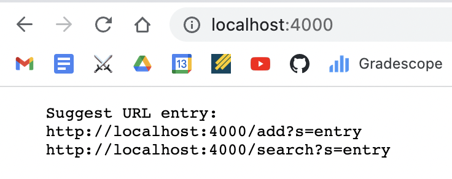<br>
methods called (Handler): `handleRequest`, `url.getPath().equals`, `String.format` <br>
method arguments value: `handleRequest("http://localhost:4000/")`, `url.getPath().equals("/")`, `String.format("""Suggest URL entry: http://localhost:4000/add?s=entry http://localhost:4000/search?s=entry""")`

Add<br>
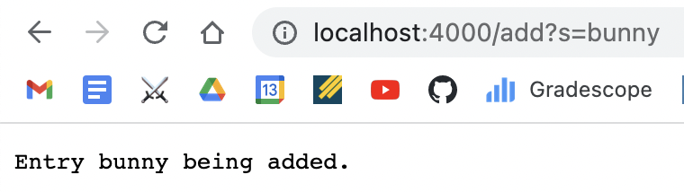<br>
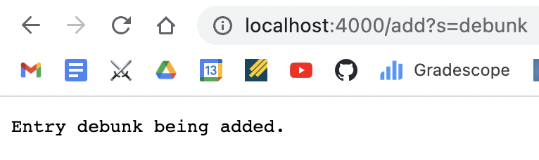<br>
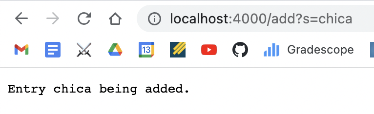<br>
methods called (Handler): `handleRequest`, `url.getPath().equals`, `url.getQuery().split`, `parameters[0].equals`, `data.add`, `String.format`<br>
method arguments value: `handleRequest("http://localhost:4000/add?s=bunny")`, `url.getPath().equals("/add")`, `parameters={s, bunny}`, `parameters[0].equals("s")`, `data.add(bunny)`, `String.format("Entry bunny being added.");`<br>
field value changed: `data={"bunny"}`, `data={"bunny", "debunk"}`, `data={"bunny", "debunk", "chica"}`<br>

Query
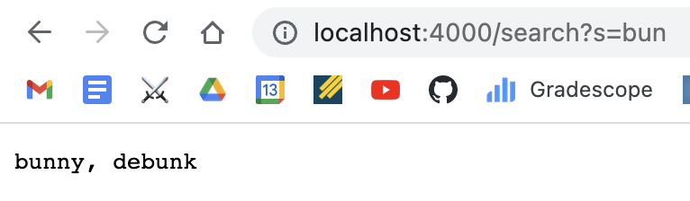<br>
methods called (Handler): `url.getPath().equals`, `url.getQuery().split`, `parameters[0].equals`, `data.size`, `data.get(i).contains`, `matches.add`, `data.get`, `matches.toString().replace`<br>
method arguments value: `handleRequest("http://localhost:4000/search?s=bun")`, `url.getPath().equals("/search")`, `parameters={s, bun}`, `parameters[0].equals("s")`, `data.size()`, `data={"bunny", "debunk", "chica"}`, `data.get(i).contains("bun")`, `matches.add("bunny") & matches.add("debunk")`, `matches={"bunny", "debunk"}`<br>

## Part 2

Please pick two files you like because there is more than two.

[ArrayExamples.java]

For method `reverseInPlace`, the failure-inducing input is: int[] input1 = {1, 2, 3, 4, 5}<br>
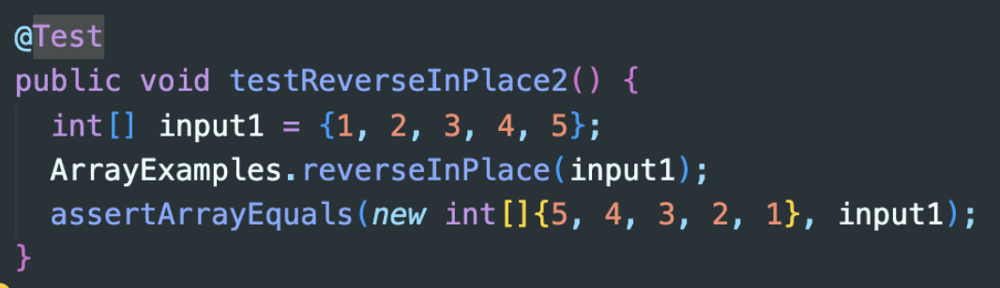<br>
The symptom is: java.lang.AssertionError: expected:<2> but was:<4>
<br>

The bug is that the for loop should stop when i==arr.length-i-1, and arr[arr.length-i-1] should also reflect the change, but it did not handle the conditions, so it should be:<br>
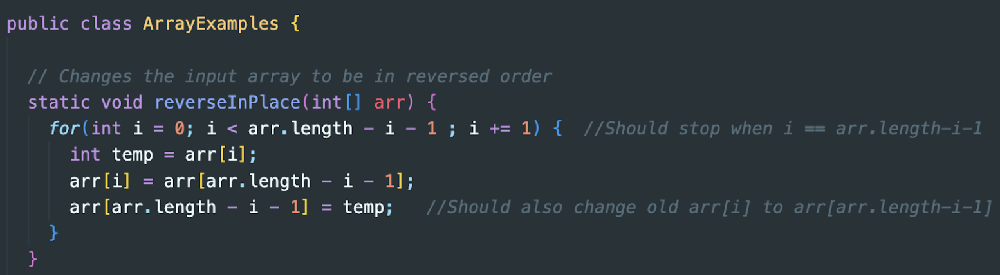<br>

For method `averageWithoutLowest`, the failure-induing input is: `double[] input1 = {1, 2, 3, 4, 6}`; <br>
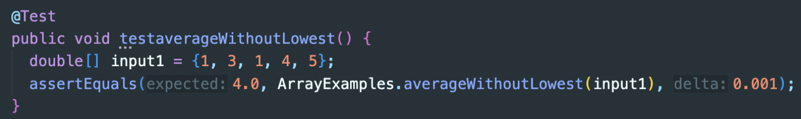<br>
The bug is the sum should be divided by total number of entries in the sum instead of arr.length because there could be duplicate lowest.<br>
Fix the bug:<br>
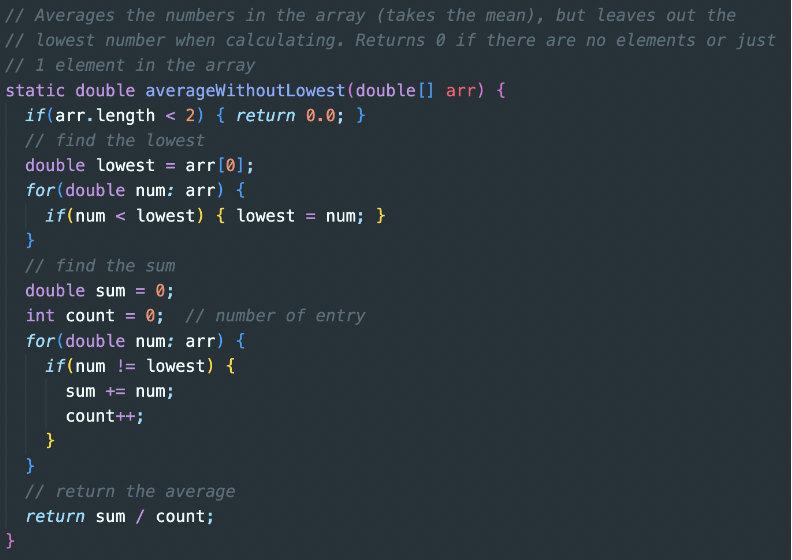<br>

[ListExample.java]

For method `filter`, the failure-inducing input is `List<String> input1 = Arrays.asList("1", "2", "3");` and `new Foo()`. <br>
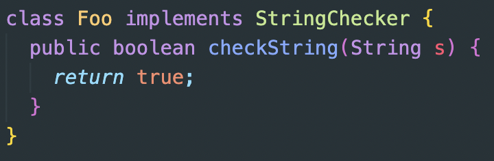 <br>
The sympton is `java.lang.AssertionError: expected:<[1, 2, 3]> but was:<[3, 2, 1]>`. <br>
The bug is `result.add(0, s);`. <br>
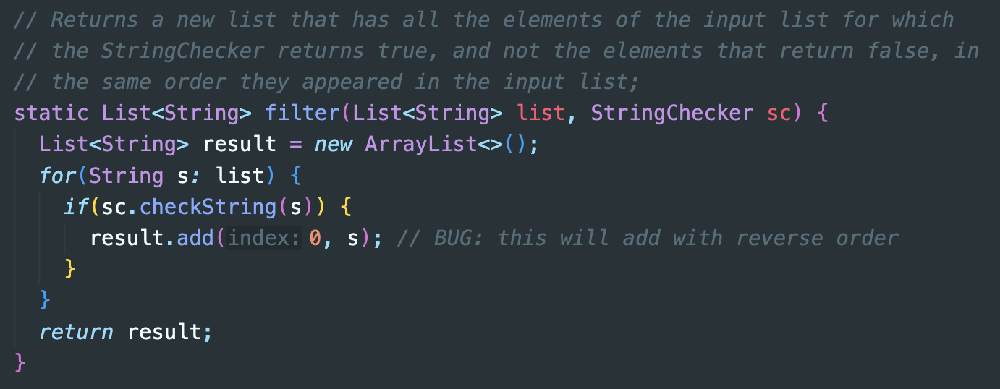 <br>
the for loop iterate through the input list by the order, so if the element s being added to the index 0 of the result (`result.add(0, s)`), the elements will become the reverse order, therefore output the sequence in the wrong order. <br>

For method `merge`, the failure-inducing input is `List<String> input1 = Arrays.asList();` and `List<String> input2 = Arrays.asList("1");`. <br>
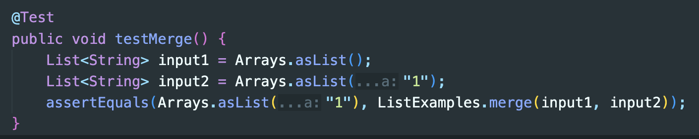 <br>
The sympton is infinite loop. <br>
 <br>
The bug is `index1 += 1;` in the last while loop, it should be `index2 += 1` instead, but because the updating variable is wrong so the while loop stuck in the infinit loop. <br>
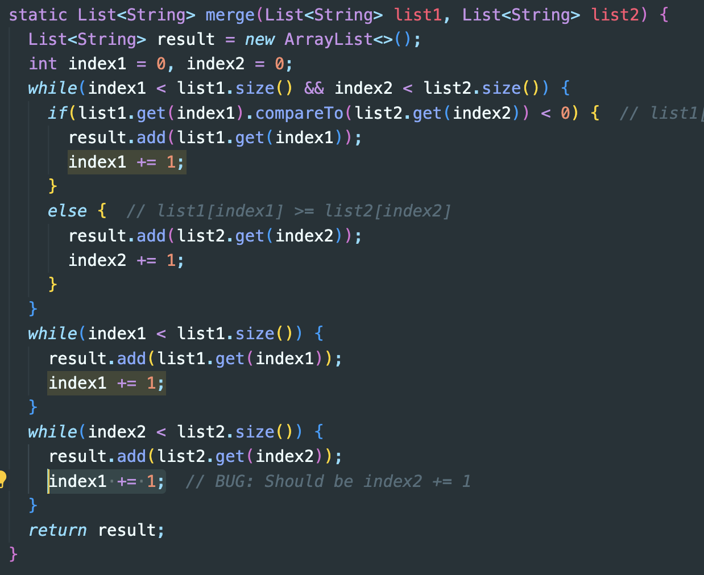 <br>

[LinkedListExample.java]

For method `append`: <br>
The failure-inducing input is `append('1')`, `append('2')`, `append('3')` (append 3 times).  <br>
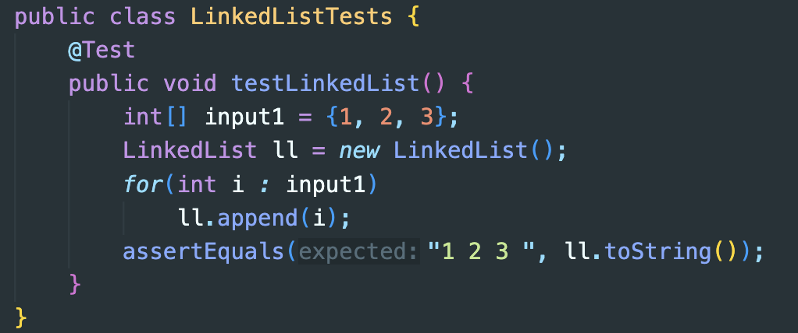 <br>
The sympton is infinite loop: <br>
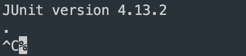 <br>
The bug is in the while loop: <br>
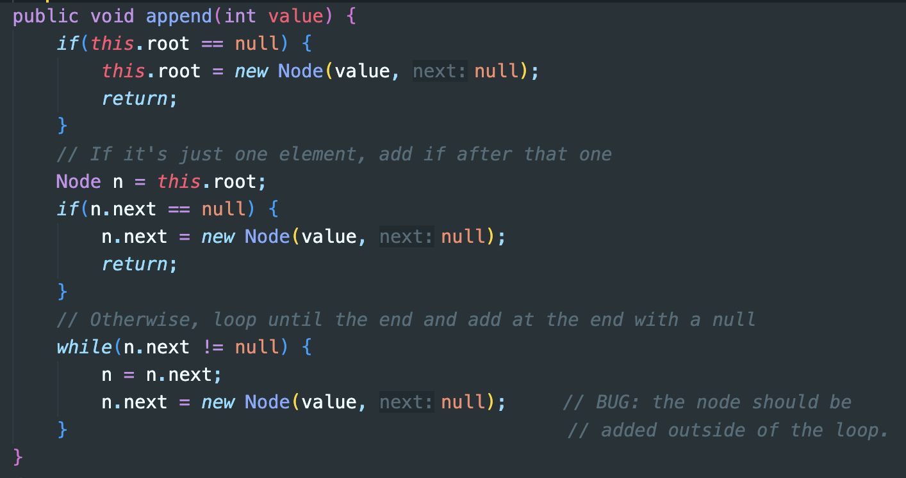 <br>
the bug code `n.next = new Node(value, null);` updates the `n.next` in the while loop, which cause `n.next` never be null, so it casued the infinite loop happened. <br>

[FileExample.java]

For method `getFile`: <br>
The failure-inducing input is `new File("file_tests_files");` <br>
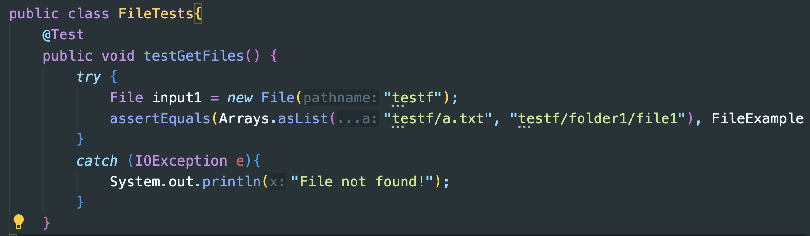 <br>
The symptom is: `java.lang.AssertionError: expected:<[testf/a.txt, testf/folder1/file1]> but was:<[testf, testf/a.txt, testf/folder1]>` <br>
The Bugs: <br>
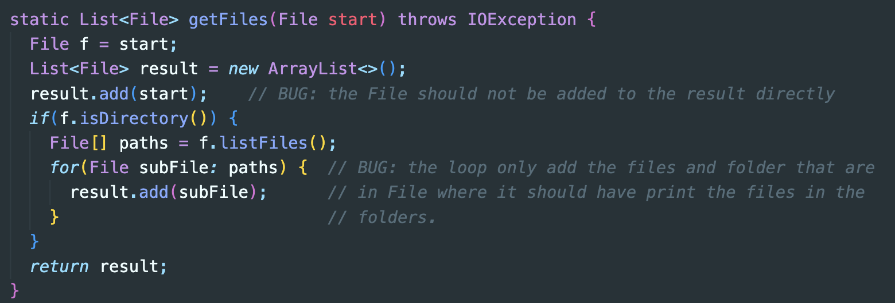 <br>
First, the bug cause the output to have the extra name of the input File (`start="testf"`). <br>
Then there is also the loop that only add the file and folder under the start folder, but it should also print the files in the sub-folder.
Thus that caused the sympton that the actual output does not match to the expected output. <br>
