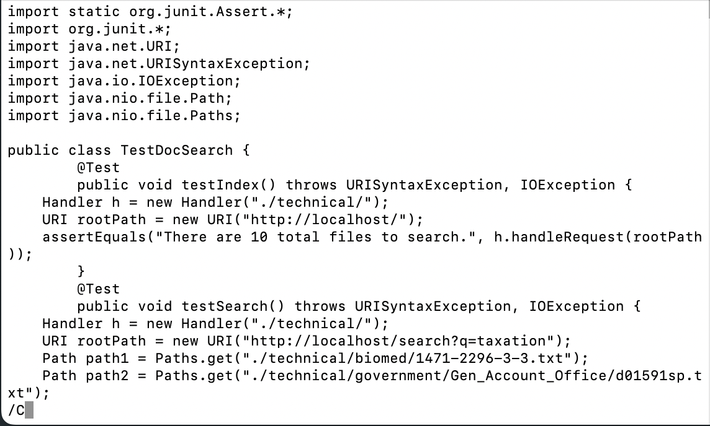
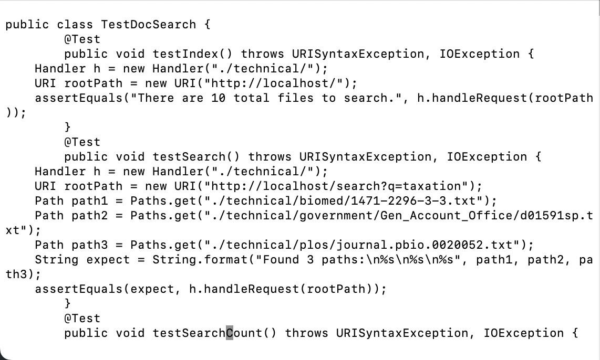
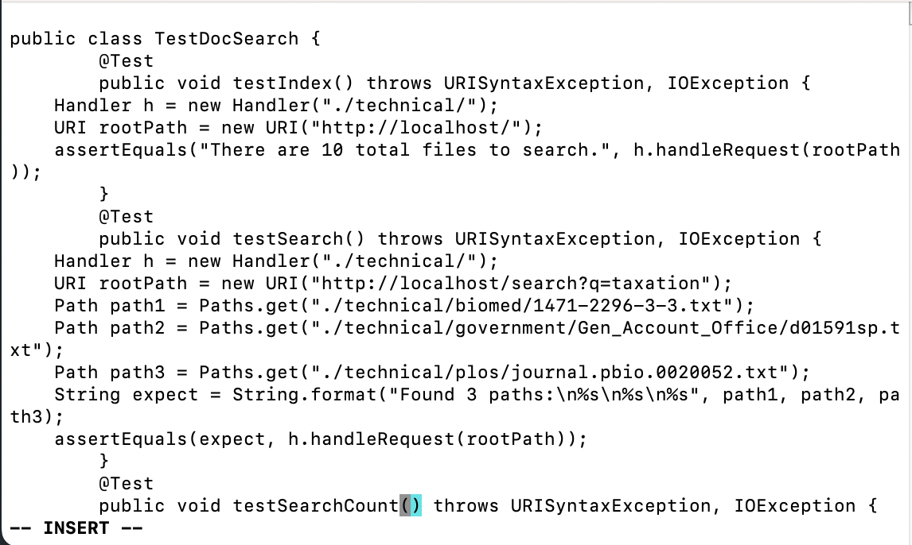
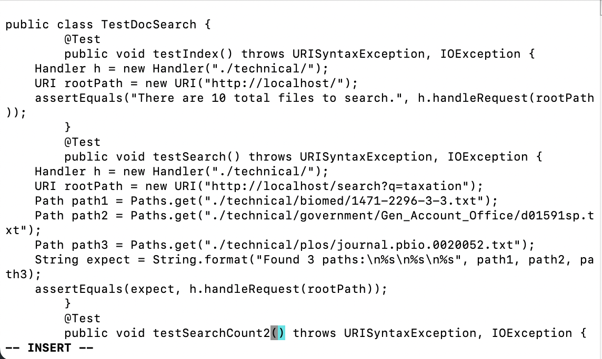
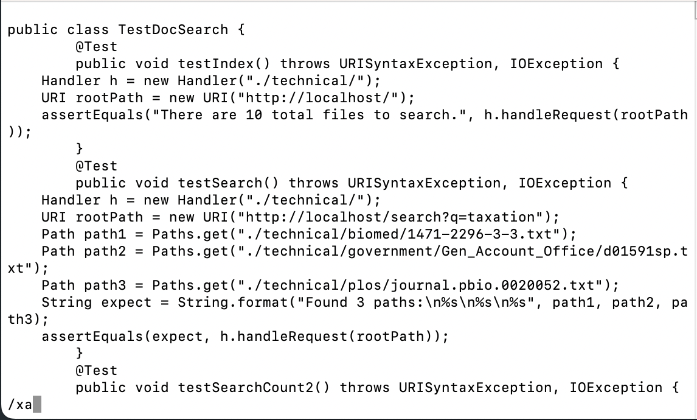
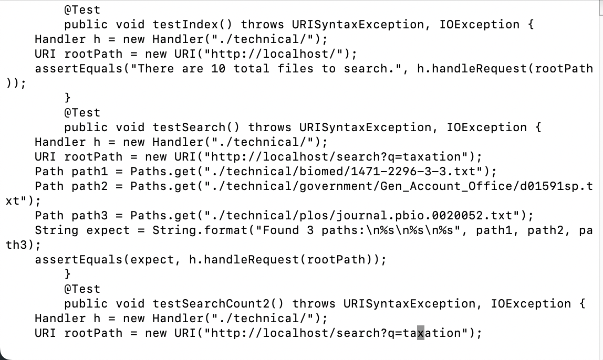
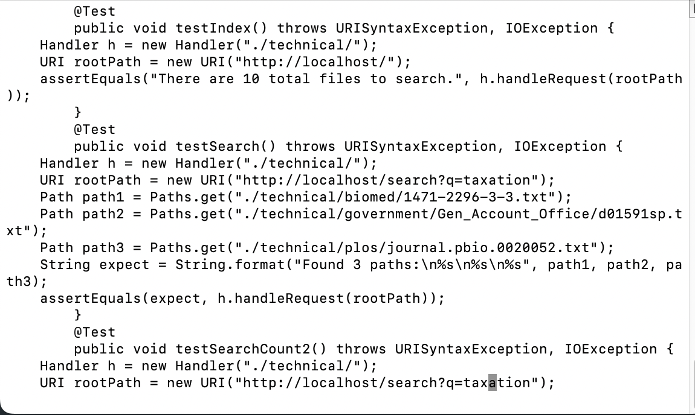
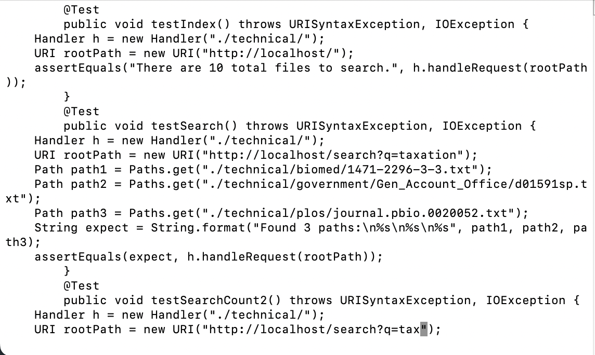
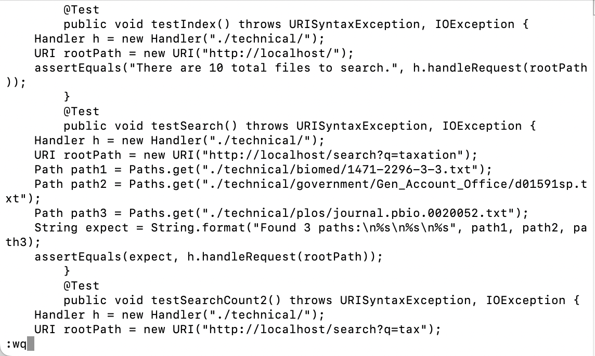

> **Challenge** In `TestDocSearch.java`, copy the test called `testSearchCount`, rename the new test to `testSearchCount2` and change the query string being tested to `tax` rather than `taxation`.

vim TestDocSearch.java

Keypress: `/` `C` `<Enter>` `e` `a` `2` `<Esc>`
`/` `x` `a` `<Enter>` `l` `d` `w` `:` `w` `q`

`/` `C`: Search for testSearch**C**ount  
  
`<Enter>`: Execute the search  
  
`e`: Move cursor to the end of the word  
  
`a`: Appending to the end of the word  
  
`2`: Add a 2 there  
  
`<Esc>`: Exit insert mode  
  
`/` `x` `a`: Search for ta**xa**tion  
  
`<Enter>`: Execute the search  
  
`l`: Go to one character right  
  
`d` `w`: Delete the rest of the word and left only tax  
  
`:wq`: Save and exit the file  
: Execute the command  
`<Enter>`  

Part 2
1. Edit content of `test.sh` to `echo "Hello World!"`  
   Run `scp test.sh cs15lfa22zz@ieng6.ucsd.edu:~/` and copy the file over to remote server  
   Run `ssh cs15lfa22zz@ieng6.ucsd.edu "bash test.sh"` to run the file which prints `Hello World!`  
   64 seconds  
2. (In remote server) run `vim test.sh`  
   Edit content of `test.sh` to `echo "Hello World!"` and save the change  
   Run `bash test.sh` which prints `Hello World!`  
   30 seconds  

- I would prefer the second way that I don't need to copy and paste the file after I make the changes, and because it is faster.

- Most of the time I would want to use the first way if I can only run the file remotely, unless maybe if there are too many edits I need to make and I am more comfortable editing codes using VSCodes plus I don't want to make mistakes when copy pasting the codes I would probably use the first way. 
