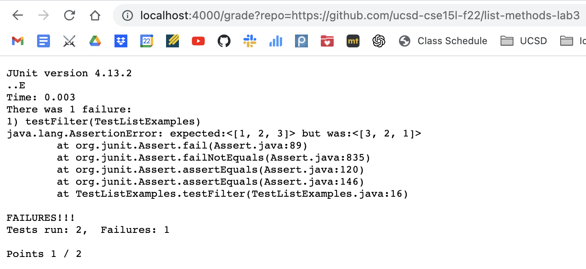
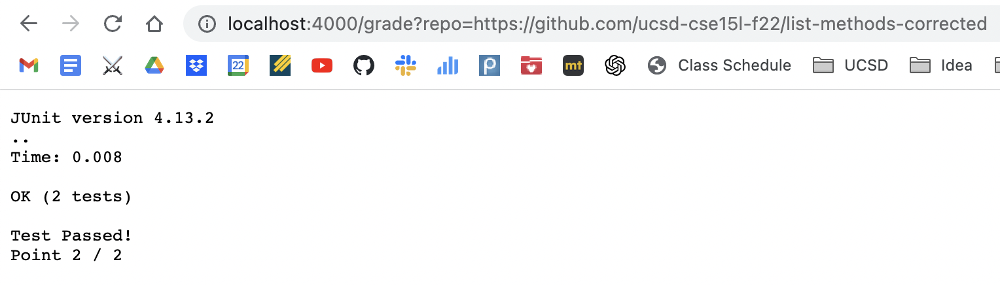
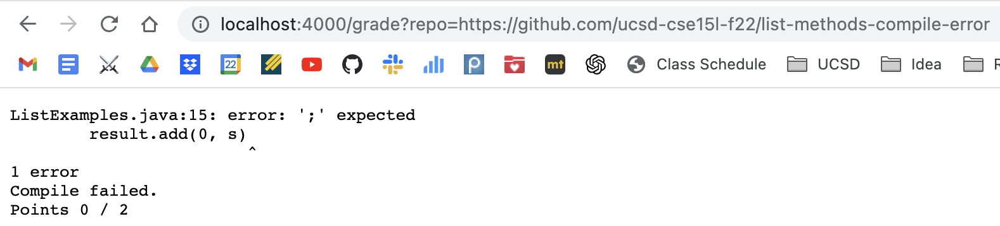

grade.sh <br>
```
CPATH=".:lib/hamcrest-core-1.3.jar:lib/junit-4.13.2.jar"

# Clone student repository
rm -rf student-submission
git clone --quiet $1 student-submission  2> clone_err     # --quiet option to prevent Clone into... output as stderr
if [ $? -ne 0 ]     # exit if clone fail
then 
    cat clone_err
    echo "Points 0 / 2"
    exit 1
fi

cd student-submission
# Check if the testing file exist
FILE_EXIST=$(find . -name "ListExamples.java")
if [ $FILE_EXIST ] && [ ! -f ListExamples.java ]
then
    echo "ListExamples.java is in the wrong directory!"
    echo "Points 0 / 2"
    exit 1
elif [ ! $FILE_EXIST ]
then
    echo "ListExamples.java not found!"
    echo "Points 0 / 2"
    exit 1
fi

# Copy test file to student submission folder
cp ../TestListExamples.java .
cp -r ../lib .

# Compile test and student's code
javac -cp $CPATH *.java
if [[ $? -ne 0 ]]   # detect error
then 
    echo "Compile failed."
    echo "Points 0 / 2"
    exit 1
fi

java -cp $CPATH org.junit.runner.JUnitCore TestListExamples

# Run the test and report grade
java -cp $CPATH org.junit.runner.JUnitCore TestListExamples > test_result
RESULT=$(grep -h "Tests run: " test_result)
if [[ ! $RESULT ]]  # all pass
then 
    echo "Test Passed!"
    echo "Point 2 / 2"
else
    echo "Points ${RESULT:25:1} / ${RESULT:11:1}"
fi
```

- https://github.com/ucsd-cse15l-f22/list-methods-lab3, which has the same code as the starter from lab 3 <br>



- https://github.com/ucsd-cse15l-f22/list-methods-corrected, which has the methods corrected (I would expect this to get full or near-to-full credit)



- https://github.com/ucsd-cse15l-f22/list-methods-compile-error, which has a syntax error of a missing semicolon. Note that your job is not to fix this, but to decide what to do in your grader with such a submission!



`rm -rf student-submission` -> no output nor error, return 0 <br>
`git clone --quiet $1 student-submission  2> clone_err` -> standard output Clone into... etc, no error, return 0 <br>
```
if [ $? -ne 0 ] 
then 
    cat clone_err
    echo "Points 0 / 2"
    exit 1
fi
```
-> does not run since the previous command return 0

cd student-submission -> no output nor error, return 0 <br>

```
if [ $FILE_EXIST ] && [ ! -f ListExamples.java ]
then
    echo "ListExamples.java is in the wrong directory!"
    echo "Points 0 / 2"
    exit 1
elif [ ! $FILE_EXIST ]
then
    echo "ListExamples.java not found!"
    echo "Points 0 / 2"
    exit 1
fi
```
-> does not run since the file exist and at the correct directory

`cp ../TestListExamples.java .` <br>
`cp -r ../lib .` <br>
-> no output nor error, return 0 <br>

`javac -cp $CPATH *.java` -> no output, 1 stderr: `ListExamples.java:15: error: ';' expected
        result.add(0, s)
                        ^
1 error`, return non 0 <br>
```
if [[ $? -ne 0 ]]   # detect error
then 
    echo "Compile failed."
    echo "Points 0 / 2"
    exit 1
fi
```
-> the condition is turn since the previous command return non 0 thus print "Compile failed." and exist, doesn't earn any credit.

The rest of the script doesn't run due to early exit.